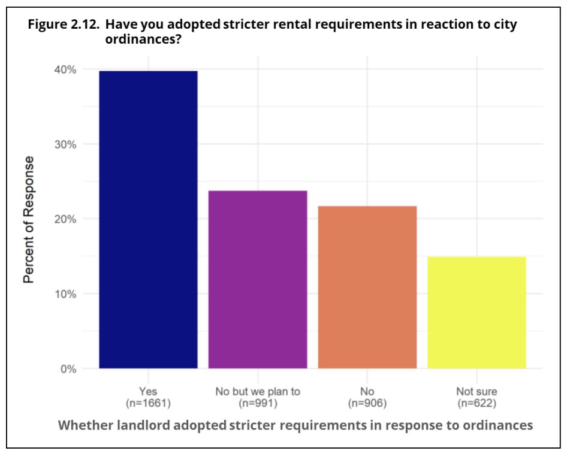
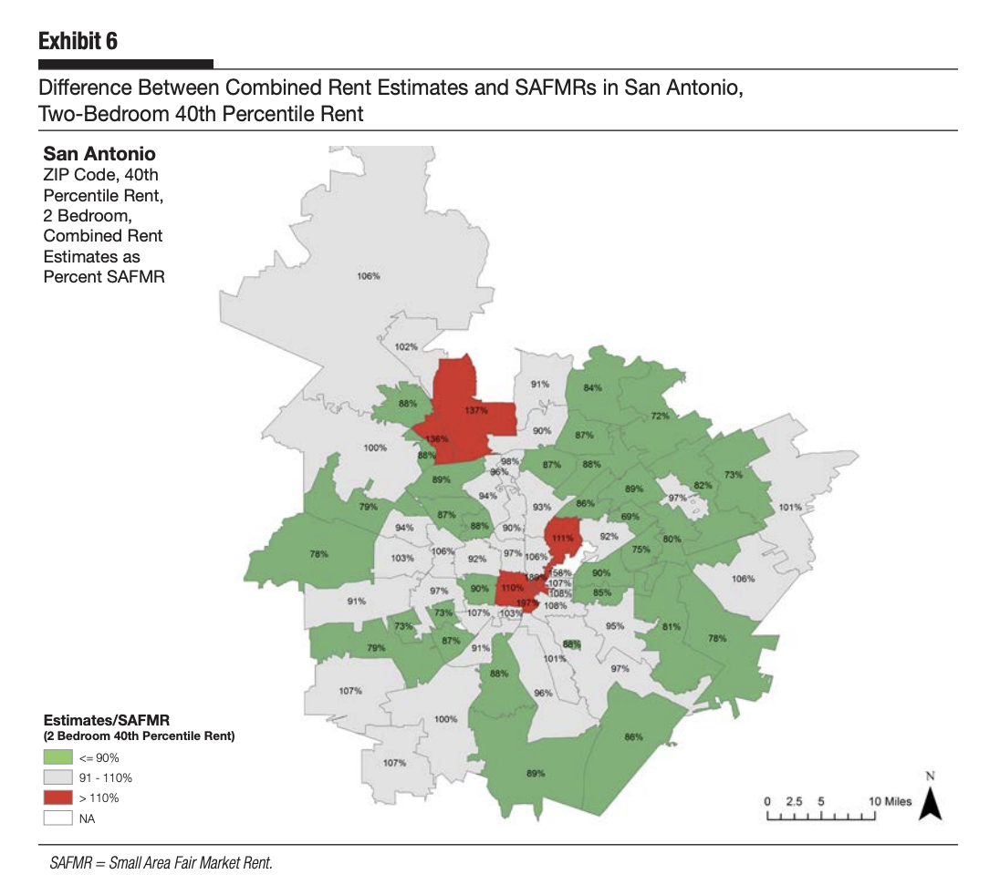
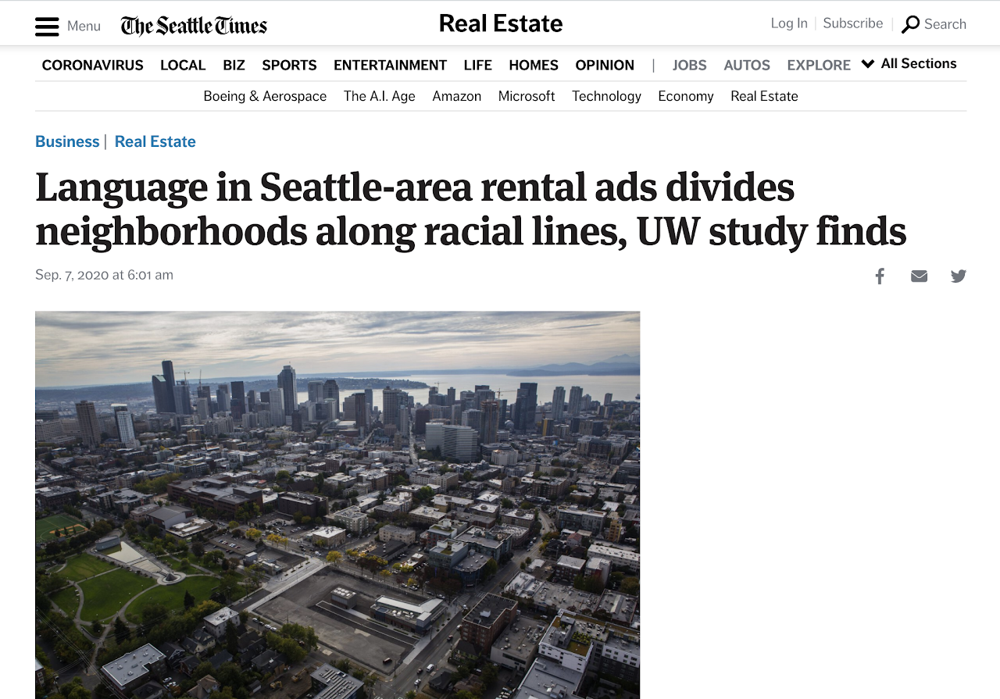
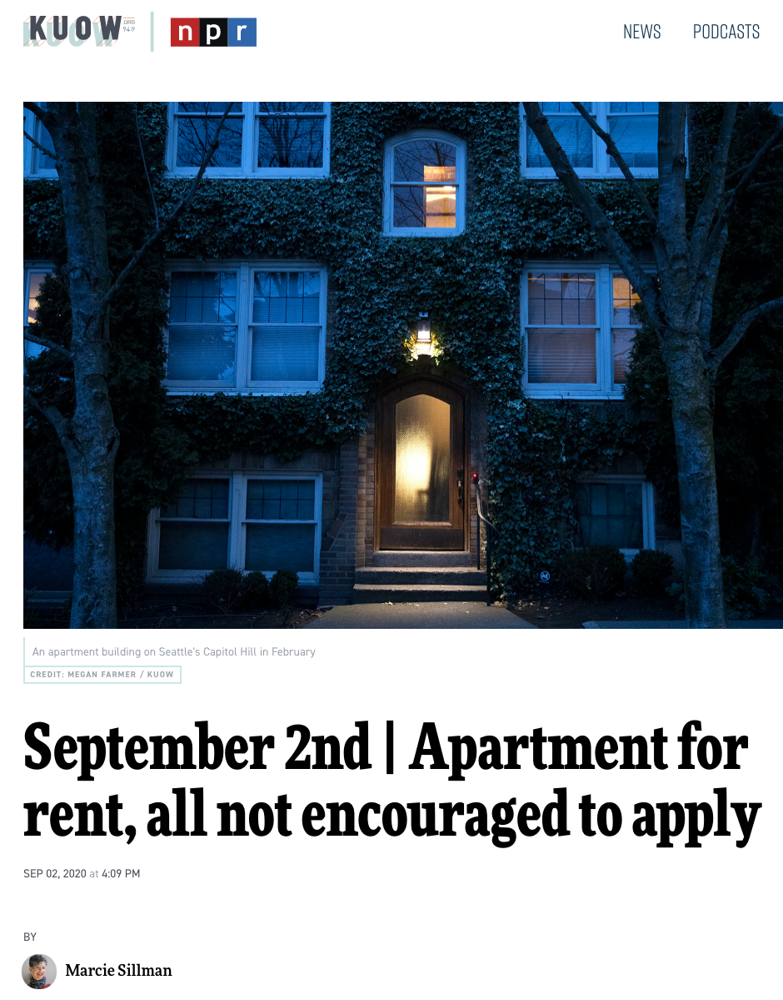
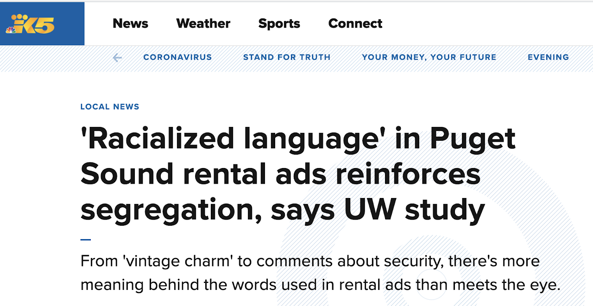

---
output:
  html_document:
    toc: true
    toc_float:
      collapsed: true
      smooth_scroll: false
    includes:
      in_header: header.html
toc_depth: 5
number_sections: true
theme: yeti
---

```{r include = FALSE}
knitr::opts_chunk$set(echo=FALSE)
```

<center>
<font size="24">The National Rent Project</font> 

{width='60%'} 
</center>  

  
*A interdisciplinary research effort at the University of Washington*


# About
The National Rent Project is a interdisciplinary effort to collect real-time rent data from online housing platforms, and to use that data to produce policy and reserach findings to further understandings of rental markets, housing outcomes, discrimination and segregation. 

# Research
## Publications

#### Seattle Rental Housing Study
```{r out.width='20%', out.extra='style="float:left; padding:10px"'}

```  
  
Published by the City of Seattle, 2018

This report summarizes a multi-method study designed to provide additional insights into
prevailing dynamics in Seattle’s rental housing market. We use a mixture of qualitative and
quantitative techniques to better understand the challenges faced by tenants in their
efforts to locate and maintain affordable housing, and to assess landlords’ characteristics,
practices, and reaction to City of Seattle (City) ordinances related to criminal background
checks and move-in fees, and the First-in-Time ordinance. In the absence of consistent
baseline data, a formal evaluation of these ordinances is not possible. Thus, a central goal
of the project is to develop baseline information to inform the development and
assessment of future ordinances. To that end, the project also reflects efforts to build new,
flexible sources of data to study variations in rent across neighborhoods and time, and an
effort to foster scientific collaborations to address these rental policies and practices.

https://www.seattle.gov/documents/Departments/CityAuditor/auditreports/UWSRHSFINAL.pdf
  
#### Comparing Small Area Fair Market Rents With Other Rental Measures Across Diverse Housing Markets  
```{r out.width='20%', out.extra='style="float:left; padding:10px"'}

```  
  
Published in *Cityscape*, 2019
  
Small Area Fair Market Rents (SAFMRs) are calculated at the 40th percentile of the U.S. postal ZIP Code instead of the metropolitan area in an effort to capture localized rents to expand choice for voucher holders to access housing in higher-opportunity neighborhoods. Existing studies on the potential and actual outcomes of SAFMRs demonstrate that findings vary for different types of housing markets. Furthermore, the decisions public housing authorities (PHAs) make in the implementation process affect PHAs' program budget and the rent burden and locational outcomes for voucher households. This study aims to address how these implementation factors are affected by local rental market conditions for three PHAs—Housing Authority of the City of Fort Lauderdale, San Antonio Housing Authority, and Seattle Housing Authority—in diverse housing markets. By comparing different sources of market rent estimates with SAFMRs in each location, we contribute new information about how this rule is likely to produce different residential outcomes in terms of increased access to low-poverty neighborhoods and adjustments to payment standards in low-rent neighborhoods. The findings reveal differences across rent measures in terms of estimated levels and relative differences across ZIP Codes. These findings suggest that housing authorities may face challenges in meeting the objectives of the SAFMR final rule without some form of local adjustments.

Hess, C., Walter, R., Acolin, A., & Chasins, S. 2019. "Comparing Small Area Fair Market Rents With Other Rental Measures Across Diverse Housing Markets." Cityscape, 21(3), 159-186. 

https://www.huduser.gov/PORTAL/periodicals/cityscpe/vol21num3/Cityscape-Nov_2019.pdf

#### Racialized Discourse in Seattle Rental Ad Texts  
```{r out.width='20%', out.extra='style="float:left; padding:10px"'}
knitr::include_graphics("images/seattle_text.jpg")
```  
  
Published in *Social Forces*, 2020  

Racial discrimination has been a central driver of residential segregation for many decades, in the Seattle area as well as in the United States as a whole. In addition to redlining and restrictive housing covenants, housing advertisements included explicit racial language until 1968. Since then, housing patterns have remained racialized, despite overt forms of racial language and discrimination becoming less prevalent. In this paper, we use Structural Topic Models (STM) and qualitative analysis to investigate how contemporary rental listings from the Seattle-Tacoma Craigslist page differ in their description based on neighborhood racial composition. Results show that listings from White neighborhoods emphasize trust and connections to neighborhood history and culture, while listings from non-White neighborhoods offer more incentives and focus on transportation and development features, sundering these units from their surroundings. Without explicitly mentioning race, these listings display racialized neighborhood discourse that might impact neighborhood decision-making in ways that contribute to the perpetuation of housing segregation.


Kennedy, Ian, Chris Hess, Amandalynne Paullada, and Sarah Chasins. 2020. "Racialized Discourse in Seattle Rental Ad Texts." Social Forces.
https://doi.org/10.1093/sf/soaa075  
  
## Media Mentions


#### [The Seattle Times](https://www.google.com/url?q=https%3A%2F%2Fwww.seattletimes.com%2Fbusiness%2Freal-estate%2Flanguage-in-seattle-area-rental-ads-divides-neighborhoods-on-racial-lines-uw-study-finds%2F&sa=D&sntz=1&usg=AFQjCNFo67mSYZ-iE6x0_VW-law0BLD81A)
```{r out.width='20%', out.extra='style="float:left; padding:10px"'}

```  
Katherine Long, writing for The Seattle Times, covered the findings from our paper "Racialized Discourse in Seattle Rental Ad Texts." She contextualized our findings with interviews from local community leaders, landlords, and sociologist Junia Howell (whom we cite!).

\  
  
\  
  
#### [NPR: KUOW](https://kuow.org/stories/september-2nd-apartment-for-rent-all-not-encouraged-to-apply)
```{r out.width='20%', out.extra='style="float:left; padding:10px"'}

```  
Project member Ian Kennedy talked with KUOW's The Record host Marcie Sillman about the findings from our paper "Racialized Discourse in Seattle Rental Ad Texts." She asked excellent questions about the implications for gentrification.


\  
  
\  
  
\  
  
\  
   
\  
   
#### [King5 News](https://www.king5.com/article/news/local/terms-in-rental-ads-reinforce-segregation-says-uw-study/281-22f37b2a-a7d2-4253-833f-1cdb39bef35c)
```{r out.width='20%', out.extra='style="float:left; padding:10px"'}

```  
Brit More, from Seattle's King 5 NBC affiliate station, interviewed project founder Kyle Crowder and member Ian Kennedy for this short piece.

\  
  
\  
  
# People
#### Kyle Crowder 

```{r out.width='20%', out.extra='style="float:left; padding:10px"'}

```  


Kyle Crowder is a Professor in the Department of Sociology at the University of Washington.  His research focuses on the processes of residential differentiation and the effects of physical and social context on racial and ethnic stratification in health and life conditions.  Most of his recent work deals specifically with processes of neighborhood selection and how racial and ethnic differences in the residential mobility processes shape broader patterns of residential segregation.  He is currently working with several collaborators, using a range of methodological approaches, to examine: the roles of racial differences in neighborhood experiences, daily activities, and social networks in processes of residential mobility and the perpetuation of racial segregation; the impacts of discrimination and anticipated discrimination on housing access; and the effects of environmental inequality and pollution exposure, as well as their interaction with both microlevel and contextual sources of stress, on health disparities.

Crowder holds a BA in Sociology from the University of Washington and a PhD in Sociology from the University at Albany.
  
#### Rebecca J. Walter  

```{r out.width='20%', out.extra='style="float:left; padding:10px"'}

```  

Rebecca J. Walter is an Associate Professor and Windermere Endowed Chair in the Runstad Department of Real Estate in the College of Built Environments at the University of Washington. She is an applied housing researcher that focuses on advancing national housing policy for low-income households. Dr. Walter analyzes the geography of inequality and opportunity in metropolitan areas across the United States. Her research addresses how housing programs and policies contribute to inequality or promote opportunity. She works closely with public housing authorities and nonprofit housing providers throughout the nation. Dr. Walter collaborates with criminal justice scholars to understand the spatial distribution of crime across various types of housing developments, commercial real estate, and land uses.  
  
Dr. Walter has over ten years of experience as a practitioner in the housing field. Prior to joining academia, she was the Director of Education, Research, and Grants at the Housing Authority of the City of Fort Lauderdale. She also worked as a project manager at the Urban Land Institute where she coordinated policy initiatives to remove regulatory barriers restricting the production of workforce housing in three metropolitan regions. Dr. Walter received her Ph.D. in Geosciences, with a specialization in Urban Geography, and a Master of Urban and Regional Planning from Florida Atlantic University. She holds a Bachelor of Science in Economics from the University of New Hampshire and a Bachelor of Arts in Psychology from the University of Nevada – Reno. Dr. Walter is a National Development Council Economic Development Finance Professional (EDFP) and Certified Planner (AICP).  
  
#### Arthur Acolin  
#### Chris Hess  
```{r out.width='20%', out.extra='style="float:left; padding:10px"'}

```  
Chris is currently a Postdoctoral Associate at Cornell University in the Department of Policy Analysis and Management, having recently received my Ph.D in Sociology at the University of Washington. His research interests focus on residential segregation, housing markets and the changing spatial distribution of place-based inequalities. He had published research in peer-reviewed outlets like Urban Affairs Review, Demography and Cityscape. His work has a quantitative focus, and he is a big proponent of the R language for statistical analysis and data visualization. He ❤ ggplot2.

His dissertation investigated the importance of rising suburban poverty for processes of residential mobility and neighborhood segregation. Empirical analyses draw on Census data and the Panel Study of Income Dynamics (PSID).
\  
  
  
\  
  
\  
  
#### Ian Kennedy  
```{r out.width='20%', out.extra='style="float:left; padding:10px"'}

```  
  
Ian Kennedy is a Doctoral candidate and computational social scientist working at the intersection of race, digital platforms, and text analysis. Their work aims to contribute to understandings of how contemporary racism works, in both visible and less visible ways. This means looking for data in new places, like in Craigslist rental ad texts, or by developing new uses for large-scale administrative data. They are also committed to producing useful work beyond scholarly publications, working with groups like the Northwest Justice Project to identify illegal Craigslist ads or with  the Election Integrity Partnership to monitor misinformation during the 2020 election.  
  
Ian recived their MA in Sociology from the University of Washington, and holds an MA in Experimental Humanities from NYU and a BA in History from Earlham College.  
  
\  
  
  
\  
  
\  
  
#### Ana Costa  
  
```{r out.width='20%', out.extra='style="float:left; padding:10px"'}

```  
  
Ana Costa is a Doctoral student of Urban Design and Planning at the University of Washington. She holds a Master of Public Administration degree from Boise State University and a bachelor’s degree in Architecture and Urbanism from the Federal University of Minas Gerais, Brazil. She also spent 18 months in Germany for a study abroad with an emphasis on sustainable development and cultural sciences. Her research interests include affordable housing policy, urban informality, and state-society relations. She has worked as a Research Assistant at the Idaho Policy Institute, where she conducted comprehensive qualitative and quantitative research to clients from the private, public, and nonprofit sectors. She has also worked in the fields of historic preservation, zoning, comprehensive planning, and participatory budgeting.
  
\  
  
  
\  
  
\  
  
#### Victoria Sass

\  
   
\  
   
\  
   
\  
   
\  
   
\  
     
\  
   
\  
   

#### Alex Ramiller  
  
\  
   
\  
   